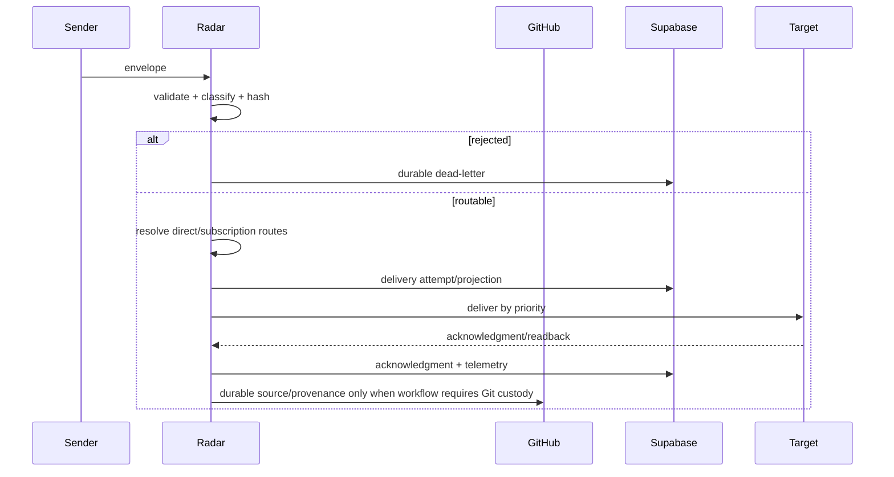

# Radar message flow

```mermaid
sequenceDiagram
    participant S as Sender
    participant R as Radar
    participant G as GitHub
    participant DB as Supabase
    participant T as Target

    S->>R: envelope
    R->>R: validate + classify + hash
    alt rejected
        R->>DB: durable dead-letter
    else routable
        R->>R: resolve direct/subscription routes
        R->>DB: delivery attempt/projection
        R->>T: deliver by priority
        T-->>R: acknowledgment/readback
        R->>DB: acknowledgment + telemetry
        R->>G: durable source/provenance only when workflow requires Git custody
    end
```

Delivery never implies incorporation; priority never implies permission; provider projection never overwrites GitHub canonical history.