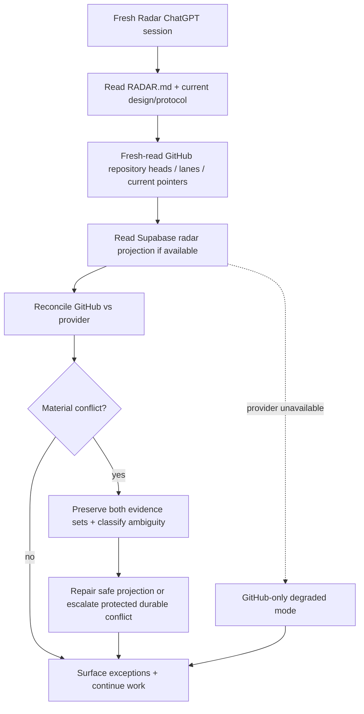

# Radar recovery / bootstrap flow

```mermaid
flowchart TD
    A[Fresh Radar ChatGPT session] --> B[Read RADAR.md + current design/protocol]
    B --> C[Fresh-read GitHub repository heads / lanes / current pointers]
    C --> D[Read Supabase radar projection if available]
    D --> E[Reconcile GitHub vs provider]
    E --> F{Material conflict?}
    F -- no --> G[Surface exceptions + continue work]
    F -- yes --> H[Preserve both evidence sets + classify ambiguity]
    H --> I[Repair safe projection or escalate protected durable conflict]
    I --> G
    D -. provider unavailable .-> J[GitHub-only degraded mode]
    J --> G
```

Recovery target: loss of a conversation or provider cache does not erase Radar's architecture, protocols, source, or durable repository provenance.